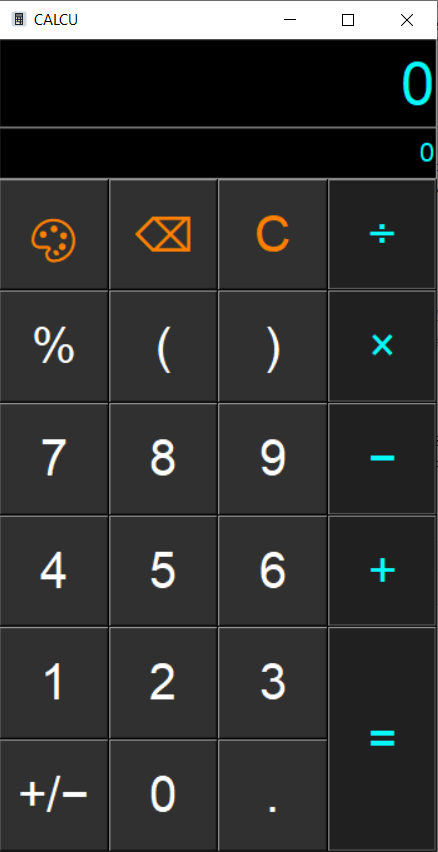

# calcu
Simple tkinter calculator-GUI inspired by the app [Stylish Calculator Free - CALCU™](https://play.google.com/store/apps/details?id=com.candl.athena&hl=gsw&gl=US)



## Versions

Tested with Python 3.9.5\
For further information check the [environment.yml](../master/environment.yml)

## Requirements
* [simpleeval](https://pypi.org/project/simpleeval/): pip install simpleeval

## Usage

Similar to the Android-App. Simply type in your equation and wait for the result to pop up.

Start the GUI with:
````
$ python calcu_gui.py
````

## Sources

#### Icons

The icons used in the GUI are from [ICONS8](https://icons8.com/)
